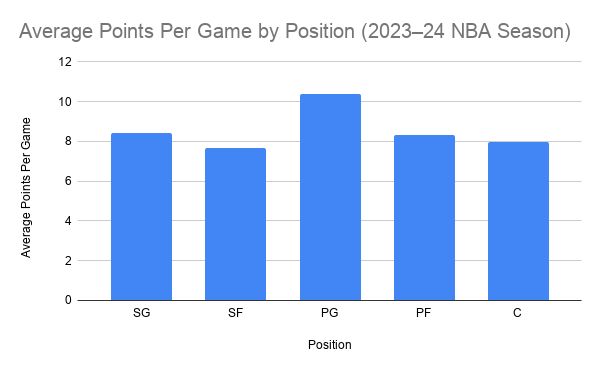
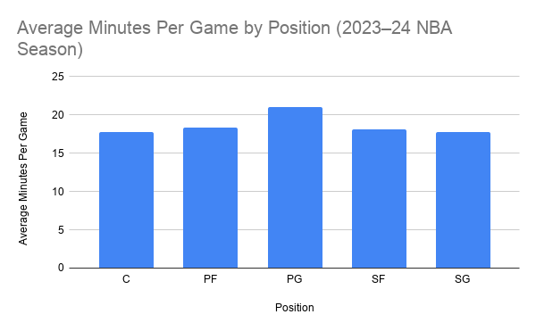

# NBA Guards Both Play More Minutes and Score More Points Than Other Positions During the 2023–2024 Season

## Introduction

The purpose of this project is to analyze NBA player’s statistics from the 2023–2024 season to determine how the positions of players compare in terms of scoring and playing.  By using Google Sheets pivot tables and data visualizations, I explored whether or not the positions that played more also scored more.  Understanding these differences provides insight into how modern NBA teams utilize players at different positions.

## Dataset

The dataset I used for this project contains player statistics from the 2023–2024 NBA season.  It includes 500+ NBA players and consists of information ranging from position to field goal percentage, including: age, team, games played, minutes per game, rebounds, assists, steals, blocks, turnovers, and points per game.

The dataset was downloaded from Kaggle, where it was compiled using publicly available NBA statistics from the 2023–2024 season.  Although Kaggle is a useful platform for sharing datasets, it is not the original data source.  Because of this, it is important to verify that the statistics accurately match official NBA records.  Since the data comes from publicly available NBA statistics, it is generally trustworthy, but journalists should still verify important findings before publishing.

One challenge I found when reviewing the data within the set is that several players are listed under multiple positions, such as SG-PG or PF-C, because they played multiple roles during the season.  For this project, those hybrid positions were removed so that only the five traditional positions (Point Guard, Shooting Guard, Small Forward, Power Forward, and Center) were compared.

## Google Sheets

Google Sheets analysis:
https://docs.google.com/spreadsheets/d/16amOk6s_E21ZcgdHZF4X4VjhESmYA-T8V3VlLlTOdWE/edit?usp=sharing

## Data Analysis

Google Sheets was used to analyze the dataset.  First, I imported the dataset into Google Sheets as a CSV file.  I then created pivot tables to compare points and minutes in correlation to positions.

The analysis showed that point guards averaged the most minutes per game and also scored the highest average points per game among the five traditional positions.  Centers averaged the fewest minutes and scored fewer points on average than guards.  While the differences were not extremely large, the results suggest that modern NBA offenses rely heavily on guards to handle the ball, create offense, and they want their ball dominant players out on the court more, as they score more, and the goal is to win by scoring more.

## Visualization 1 – Average Points Per Game by Position

The first chart compares the average points per game for each of the five traditional NBA positions.  Point guards averaged the highest number of points per game, followed by shooting guards and then power forwards.  Centers averaged the fewest points per game among the positions included in the analysis.

This visualization demonstrates how scoring responsibilities in today's NBA are often concentrated among guards, who typically control the offense and create scoring opportunities both for themselves and their teammates.  The bar chart makes it easy to compare scoring production across positions.

## Visualization 2 – Average Minutes Per Game by Position

The second chart compares the average minutes played per game for each position.  Point guards also averaged the most playing time, while centers, the lowest scorers, averaged the fewest minutes per game.  The remaining positions fell between these two extremes.

This chart supports the findings from the first visualization by showing that the positions receiving the most playing time also tend to produce more points.  Coaches often keep their primary ball handlers and offensive creators on the floor longer because they have a greater impact on the game.

## Ethical Considerations

Although this dataset is based on official NBA statistics, it does not tell the complete story of a player's value.  The question this project answers makes it seem as if point guards matter while the rest of the positions matter less or not at all.  That is not the case or point at all, this simply is looking to answer a different question then positional value.  Statistics such as points and minutes do not measure leadership, defensive positioning, teamwork, or other contributions that may not appear in the box score.  Additionally, removing hybrid positions simplified the analysis but also reduced some of the complexity of modern basketball, where many players regularly play multiple positions.

To make this a more complete story, additional reporting could include interviews with coaches or analysts, advanced statistics such as Player Efficiency Rating (PER) or Win Shares, and comparisons across multiple NBA seasons to determine whether these trends remain consistent over time.

## Conclusion

This project examined player statistics from the 2023–2024 NBA season using Google Sheets pivot tables and data visualizations.  The analysis found that point guards averaged both the highest points per game and the most minutes played among the five traditional positions.  Centers generally averaged the fewest points and playing time, while forwards fell between guards and centers.  With that being said, as I mentioned earlier, the relationship between positions, points, and minutes was shown, but other stats and values were not being analyzed.  

Creating pivot tables and charts made it much easier to identify patterns than simply reading hundreds of rows of data.  The project also demonstrated the importance of selecting appropriate chart types and cleaning data before analysis.  Overall, the findings suggest that modern NBA offenses rely heavily on point guards to create scoring opportunities and remain on the court for extended periods.
